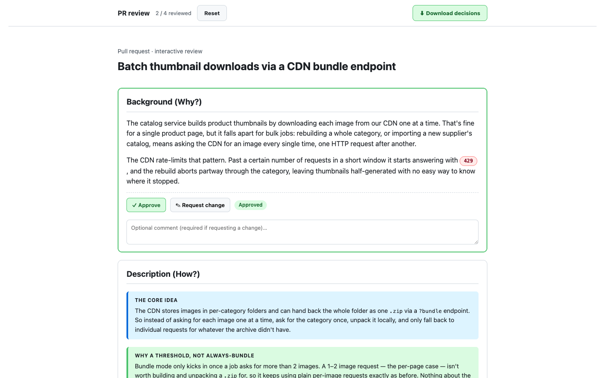
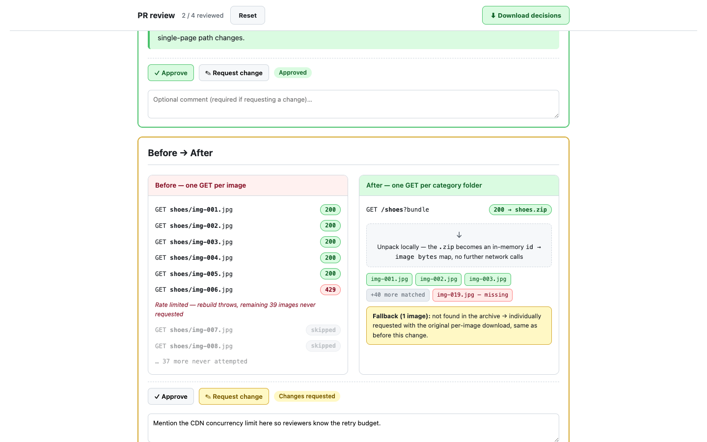

# pr-narrative

[](https://github.com/vercel-labs/skills)

An agent skill with two jobs: it **reviews pull requests with you**, and it **writes
the descriptions for the ones you open yourself.**

Reviewing a PR usually means opening a diff cold: no context for why the change
exists, and comments left one at a time with no way to gather them into an actual
review. Writing one has the mirror problem. The author understands the change, but
the description rarely conveys it, so the reviewer starts cold anyway.

**Reviewer mode** fixes the first half. Point it at a PR (or a local branch that
doesn't have one yet) and it builds a page with the narrative context up top and the
real diff below it: click a line to comment, optionally triage a small, capped set of
AI-drafted risk callouts, then hit Submit. Against a real PR, your accepted comments
land as a **pending** GitHub review, one you finalize yourself, on github.com, by
clicking Approve, Request changes, or Comment. Reviewing a local branch produces the
same page but posts nothing; Submit hands you back a fix-list instead.

**Author mode** is the original pitch, unchanged: it writes **pull-request
descriptions that read like a clear explainer instead of a code dump.** Most PR
descriptions are written for the author, not the reviewer — they list which files
changed and restate the diff in prose the reviewer can already see. This mode does the
opposite: it gives the reviewer the *context* and the *mental model* they need before
they read a single line of the diff. It answers **"why does this change exist?"** and
**"what's the core idea?"**, using a styled before/after visual, small concrete
examples, and comparison tables.

Both modes share the same narrative discipline (a Background/Description panel, no
mermaid diagrams, no method-name dumps) and both stop short of the final action:
reviewer mode never submits a verdict, author mode never opens the PR. You always take
that last step yourself.

## What it produces

### Reviewer mode

An annotation page, plus one of two outcomes depending on whether a PR exists yet.

1. **An annotation page**: the same styled narrative panel as author mode up top
   (Background/Description, no mermaid, no ASCII art), with the actual diff rendered
   below it across two line-number gutters. Click a line to comment, drag across a few
   lines for a range, or leave a suggestion. The skill can also pre-seed a small,
   capped set of AI-drafted risk callouts (probable bugs, security issues, missing
   error handling, breaking-change risk, up to 3 per file and 10 per review), each
   shown visually distinct from your own comments and unaccepted by default; you
   decide which ones to keep.
2. **A pending GitHub review** (PR path). On Submit, your accepted comments and
   drafts post to the PR as a single pending review. Nothing is finalized: you still
   open the PR on github.com and click Approve, Request changes, or Comment yourself.
   If a pending review from you already exists on that PR, the skill asks whether to
   replace it or leave it alone; it never creates a second one.
3. **A local fix-list** (no PR yet). Reviewing a branch before you've opened a PR
   builds the same annotation page, but nothing gets posted anywhere. Submit hands you
   a Markdown fix-list of your accepted findings instead, with a reminder that they're
   unverified until you confirm each one.

The flow: **fetch the diff → explain it → annotate (triage any AI drafts) → Submit →
pending review on GitHub** (or a fix-list, for a local branch).

### Author mode

Two artifacts, plus an interactive review loop:

1. **An interactive HTML review page** — it **opens automatically in your browser**
   and shows the rich visual (report-quality before/after panels — colored request
   rows, a red failure, an "extract locally" step, file chips — and the
   Background/Description narrative), with **Approve / Request-change** controls and a
   comment box under each section. You review section by section and click **Submit**;
   your decisions go straight back to the agent via a small bundled local server
   (`scripts/review_server.py`, Python stdlib, no installs), which revises until every
   section is approved. If the server isn't running, the page falls back to a
   **Download decisions** button. No mermaid, no ASCII art — real HTML/CSS.
2. **A GitHub-flavored Markdown PR body** — fills your repo's PR template, is complete
   on its own (a reviewer who never opens the HTML still gets the full story), uses
   GitHub `> [!NOTE]` / `> [!TIP]` callouts and comparison tables, and links to the
   review page for the rich visual.

The loop is: **generate → auto-open review page → approve / request changes per
section → download decisions → agent revises → re-open → repeat until approved.**

It deliberately avoids **mermaid diagrams**, **file-by-file changelogs**, and
**method-name dumps**. It never opens a PR for you — you get the files and decide when
to create the PR.

> See [`examples/`](./examples) for a generated pair built from a generic, invented
> scenario: the [Markdown body](./examples/pr-body-thumbnails.md) and the
> [HTML visual](./examples/pr-thumbnails.html) (open it in a browser).

## Example output

The examples use a made-up scenario — a service that downloaded product thumbnails one
at a time (hitting a CDN rate limit) and now fetches a whole category as a single
bundle. The Markdown body leads with the problem and the core idea, then shows a
comparison table:

```markdown
## Background (Why?)

The catalog service downloads product thumbnails from the CDN one at a time. That's
fine for a single page, but bulk jobs — rebuilding a whole category — issue one HTTP
request per image, and the CDN rate-limits that pattern with `429`.

## Description (How?)

The core idea: the CDN can hand back a whole category folder as one `.zip` via a
`?bundle` endpoint. So instead of asking for each image one at a time, ask for the
category once and unpack it locally.

| Scenario                    | Requests before | Requests after |
| --------------------------- | --------------- | -------------- |
| Single product page (1 img) | 1               | 1 (unchanged)  |
| Category rebuild (45 imgs)  | 45              | 1              |
```

The HTML companion renders the same before/after as styled panels with `200`/`429`
badges and file chips.

## See it in action

The Markdown above pairs with a live, interactive review page, not a static mockup:


The full page in the browser: narrative panels, a green "Approved" status pill on the
Background section, "2 / 4 reviewed" progress, and a `429` badge from the rate-limit
story.


The "Before → After" section in its amber "Changes requested" state, with a reviewer
comment already filled in below the control bar. This is the per-section
Approve / Request-change loop in action, one verdict at a time before Submit.

## Installation

This is an agent skill (a `SKILL.md` plus reference files). The easiest way to install
it is with the [`skills` CLI](https://github.com/vercel-labs/skills) — a package
manager for agent skills that uses GitHub as its registry and supports Claude Code,
OpenCode, Cursor, Codex, and [70+ more agents](https://github.com/vercel-labs/skills#supported-agents).

**One command (recommended):**

```bash
npx skills add hamedghaderi/PR-Review
```

That's it. The CLI clones the repo, finds the `pr-narrative` skill, detects your agent,
and installs it to the right directory. No SSH keys, no manual copying.

Useful variants:

```bash
# Preview the skill before installing
npx skills add hamedghaderi/PR-Review --list

# Install to specific agents
npx skills add hamedghaderi/PR-Review -a opencode -a claude-code

# Install globally (user-level) and skip prompts
npx skills add hamedghaderi/PR-Review -g -y

# Copy files instead of symlinking (more portable)
npx skills add hamedghaderi/PR-Review --copy
```

<details>
<summary><strong>Manual install (clone and copy)</strong></summary>

If you'd rather not use the CLI, clone the repo and copy the skill folder into your
agent's skills directory:

```bash
git clone https://github.com/hamedghaderi/PR-Review.git
```

Pick the location your agent uses:

```bash
# OpenCode / .agents-style skills:
mkdir -p ~/.agents/skills/pr-narrative
cp -R PR-Review/SKILL.md PR-Review/references ~/.agents/skills/pr-narrative/

# Claude Code / .claude-style skills:
mkdir -p ~/.claude/skills/pr-narrative
cp -R PR-Review/SKILL.md PR-Review/references ~/.claude/skills/pr-narrative/
```

Only `SKILL.md` and `references/` are needed for the skill to work; `examples/` is
just for reference.

</details>

## Usage

Once installed, the skill triggers on either intent: reviewing a diff, or writing a
description for one.

**To review**, natural phrasings that trigger it:

- `"review this PR <url>"`
- "review PR #42"
- "review my branch" / "review my changes before I open a PR"

The agent fetches the PR (or diffs your branch locally if there's no PR yet), writes
the same kind of narrative it uses for author mode, builds the annotation page, and
opens it in your browser. Leave comments on the lines that matter, triage any
AI-drafted callouts, and click **Submit**. Reviewing a real PR needs `gh` installed
and authenticated, since that's how the skill fetches PR data and posts the pending
review. Reviewing a local branch needs no `gh` at all.

**To write a PR description**, natural phrasings that trigger it:

- "write the PR for this branch"
- "make a PR description for these changes"
- "describe this change for review"

The agent will read the diff against your base branch, understand the change, generate
the review page and open it in your browser. Review each section (Approve / Request
change), click **Download decisions**, and hand the file back; the agent revises until
you've approved everything, then gives you the final Markdown. Create the PR yourself
(the skill won't open it for you). Author mode never touches `gh` either; it only
reads your local git history and diff.

If the request is genuinely ambiguous ("review my changes before I open a PR" could
mean either), the agent asks one clarifying question rather than guessing.

## Repository layout

```
.
├── SKILL.md                  # the skill definition + workflow for both modes
├── references/
│   ├── html-visual.md        # HTML/CSS for the before/after panels + worked example
│   ├── markdown-body.md      # GitHub callout/table conventions + worked example
│   ├── review-ui.md          # author mode's review page: controls, submit JS, decisions schema
│   ├── reviewer-ui.md        # reviewer mode's annotation page: AI pre-seed policy, submit flow, decisions schema
│   ├── annotation-schema.md  # data contracts: annotation objects, diff JSON, submission payload, fix-list
│   └── github-posting.md     # gh preflight, pending-review collision check, posting, error table
├── assets/
│   └── review-template.html  # reviewer mode's annotation page (diff renderer + comment UI)
├── scripts/
│   ├── review_server.py      # live review server (stdlib): serves either page, captures Submit, writes decisions
│   ├── diff_anchor.py        # parses PR file patches into hunks, validates comment anchors
│   ├── build_review.py       # turns accepted annotations into a GitHub pending-review payload
│   └── tests/                # unit tests for the anchoring, payload, and server logic
├── examples/
│   ├── pr-body-thumbnails.md   # a generated Markdown PR body (generic scenario)
│   ├── pr-thumbnails.html      # the matching HTML visual (open in a browser)
│   ├── pr-review-demo.html     # interactive review-page demo (for README screenshots)
│   └── screenshots/            # hero-review-page.png, section-controls.png (README screenshots)
├── README.md
└── LICENSE
```

## License

[MIT](./LICENSE)
