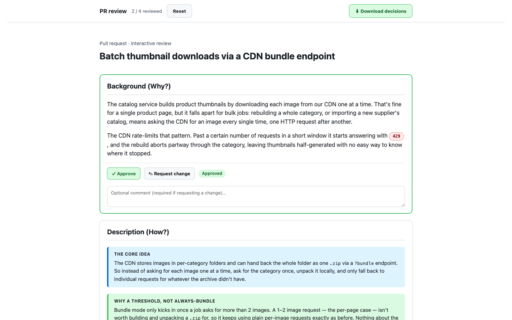

# PR Narrative

[](https://github.com/vercel-labs/skills)

Review pull requests as a story, not a wall of code.

PR Narrative adds a human review layer between coding agents and GitHub, on both sides
of a pull request:

- **Reviewer mode:** review a real diff in an interactive browser UI, accept or reject AI findings, and create one pending GitHub review
- **Author mode:** turn your branch diff into a reviewer-friendly PR description

```bash
npx skills add hamedghaderi/pr-narrative
```

### 22-second demo: a cold diff becomes an annotated review

https://github.com/user-attachments/assets/2f2cb4b7-e87d-43bc-830b-5129ebfa8110

## Why not just ask an agent to review the PR?

You can, and it will find real things. The gap isn't analysis quality, it's what
happens to the findings afterwards. Ask an agent to review a PR and you get prose in a
terminal: not attached to any line, invisible to your teammates, and changing nothing on
the PR itself.

| | Plain agent prompt | Reviewer mode |
|---|---|---|
| Where findings land | Terminal scrollback | A pending review on the PR, anchored to real diff lines |
| How many you get | However many it feels like writing | Hard cap: 3 per file, 10 per review |
| What it comments on | Anything, including style opinions | Four categories only: probable bugs, security, missing error handling, breaking-change risk |
| Who decides what counts | Already written; you skim it | Every AI finding arrives unaccepted. Nothing reaches GitHub until you click Accept |
| Who signs the review | Ambiguous | You do. The skill never sets Approve, Request changes, or Comment |

The cap is the constraint that matters most. An unconstrained agent has no reason to
stop at three findings in a file, so it writes eleven, and the two that mattered get
buried under nine that didn't. Seeding zero findings is an explicitly valid outcome:
when nothing in the diff clears the bar, the page opens with no AI comments at all.

## How it works

### Reviewer mode

PR URL or local branch → narrative context → interactive diff → accept or reject AI
findings → **pending GitHub review**, or a local fix-list

The page puts the narrative up top and the real diff below it. Click a line to comment,
drag across a few lines for a range, or leave a suggestion. AI-drafted callouts arrive
unaccepted, so nothing reaches GitHub that you didn't keep. On Submit, your accepted
comments post as a single pending review that you finalize yourself on github.com.
Reviewing a local branch posts nothing anywhere.

### Author mode

Branch diff → narrative PR body → section-by-section approval → revision loop →
**final Markdown**

It writes the description from the code rather than the ticket. You Approve or
Request-change each section, your decisions go back through a small bundled local
server, and it revises until everything is approved. The body fills your repo's PR
template and stands on its own.

Both modes avoid mermaid diagrams, file-by-file changelogs and method-name dumps, and
Author mode never opens the PR for you.

## Example output


The before panel shows one-request-per-image calls hitting a red `429` and stalling the
rest of the batch; the after panel shows the single `?bundle` request unpacking into
file chips instead.


Two adjacent sections, two independent verdicts: "Description" is green "Approved",
"Before → After" is amber "Changes requested". Each section carries its own state until
every one is approved.

<details>
<summary><strong>The generated Markdown PR body</strong></summary>

A made-up scenario: a service that downloaded product thumbnails one at a time, hit a
CDN rate limit, and now fetches a whole category as a single bundle.

```markdown
## Background (Why?)

The catalog service builds product thumbnails by asking the CDN for one image at a
time: a single request per thumbnail. That works fine on a product page, where only
one image is ever needed, but a category rebuild asks for every image in that
category back to back, with nothing pacing the requests out.

## Description (How?)

Category rebuilds now ask the CDN for the whole category as one `.zip`, through a
`?bundle` endpoint, instead of requesting each image on its own. The archive gets
unpacked locally, and only images the bundle doesn't have fall back to the old
per-image download.

For a category with 45 images:

| | Before | After |
|---|---|---|
| Requests to the CDN | 45 (one per image) | 1 bundle plus rare fallbacks |
| Where it fails | Aborts on the ~6th request (`429`) | Completes; only genuinely missing images fall back |
| Images actually built | 5 of 45 | 45 of 45 |
```

The HTML companion renders the same before/after as styled panels. Both files live in
[`examples/`](./examples).

</details>

> **Useful? Star it so other developers can find it.**

## Works with

Any coding agent that loads `SKILL.md` files: **Claude Code**, **OpenCode**, **Cursor**,
**Codex** and [70+ more](https://github.com/vercel-labs/skills#supported-agents).

## Installation

```bash
npx skills add hamedghaderi/pr-narrative
```

The CLI clones the repo, finds the `pr-narrative` skill, detects your agent, and
installs it to the right directory. For flags like `--list`, `-g` and `--copy`, see the
[`skills` CLI docs](https://github.com/vercel-labs/skills).

<details>
<summary><strong>Requirements by mode</strong></summary>

| Requirement | Reviewer mode | Author mode |
|---|---|---|
| `git` and a browser | Required | Required |
| `gh`, authenticated | Only to review a real PR; reviewing a local branch needs none | Never used. Reads your local git history only |
| `python3` | Optional. Runs the live review server; without it the page falls back to a download button | Optional, identical fallback |

</details>

<details>
<summary><strong>Manual install (clone and copy)</strong></summary>

```bash
git clone https://github.com/hamedghaderi/pr-narrative.git

# OpenCode / .agents-style skills:
mkdir -p ~/.agents/skills/pr-narrative
cp -R pr-narrative/SKILL.md pr-narrative/references ~/.agents/skills/pr-narrative/

# Claude Code / .claude-style skills:
mkdir -p ~/.claude/skills/pr-narrative
cp -R pr-narrative/SKILL.md pr-narrative/references ~/.claude/skills/pr-narrative/
```

Only `SKILL.md` and `references/` are needed; `examples/` is just for reference.

</details>

## Usage

The skill triggers on either intent, and confirms which one with a single question
before it starts rather than guessing.

**To review:** "review this PR <url>", "review PR #42", "review my branch before I open
a PR".

**To write a description:** "write the PR for this branch", "make a PR description for
these changes", "describe this change for review".

## License

[MIT](./LICENSE)
